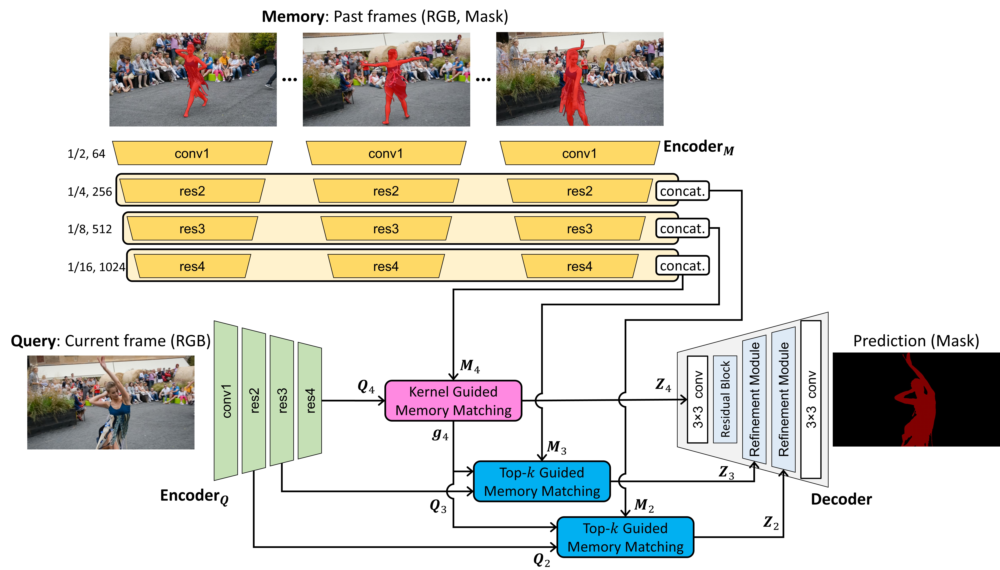

## Hierarchical Memory Matching Network for Video Object Segmentation
### Hongje Seong, Seoung Wug Oh, Joon-Young Lee, Seongwon Lee, Suhyeon Lee, Euntai Kim
### ICCV 2021



This is the implementation of HMMN.  
This code is based on STM (ICCV 2019): [[link](https://github.com/seoungwugoh/STM)].  
Please see our paper for the details: [[paper]](https://arxiv.org/abs/2109.11404)

[](https://www.youtube.com/watch?v=zSofRzPImQY "Hierarchical Memory Matching Network for Video Object Segmentation (ICCV 2021)")

## Dependencies
* Python 3.8
* PyTorch 1.8.1
* numpy, opencv, pillow

## Trained model
* Download pre-trained weights into the same folder with demo scripts <br>Link: [[weights](https://drive.google.com/file/d/16vOMm7hIdmC6yL4FlBO4p_miTeUoskt7/view?usp=sharing)]


## Code
* DAVIS-2016 validation set (Single-object)
```bash
python eval_DAVIS.py -g '0' -s val -y 16 -D [path/to/DAVIS]
```
* DAVIS-2017 validation set (Multi-object)
```bash
python eval_DAVIS.py -g '0' -s val -y 17 -D [path/to/DAVIS]
```

## Pre-computed Results
We also provide pre-computed results for benchmark sets.
* [[DAVIS-16-val]](https://drive.google.com/file/d/1SqzBktU0DrSd5_vC7TVmPtXJBn3bqAfG/view?usp=sharing)
* [[DAVIS-17-val]](https://drive.google.com/file/d/1uDx8rPo91qEnoE_nBCYF-A-G8noRq6G8/view?usp=sharing)
* [[DAVIS-17-test-dev]](https://drive.google.com/file/d/18-p2ihxfHZisOghWiSpvlfbhpy1j1oSl/view?usp=sharing)
* [[YouTube-VOS-18-valid]](https://drive.google.com/file/d/1cE9rtqdafXGm7V3rP2ZSXq56atoXVUg3/view?usp=sharing)
* [[YouTube-VOS-19-valid]](https://drive.google.com/file/d/1bA2iv2KhjYGlw5i25dLPf24byt-5On2r/view?usp=sharing)


## Bibtex
```
@inproceedings{seong2021hierarchical,
  title={Hierarchical Memory Matching Network for Video Object Segmentation},
  author={Seong, Hongje and Oh, Seoung Wug and Lee, Joon-Young and Lee, Seongwon and Lee, Suhyeon and Kim, Euntai},
  booktitle={Proceedings of the IEEE/CVF International Conference on Computer Vision},
  year={2021}
}
```


## Terms of Use
This software is for non-commercial use only.
The source code is released under the Attribution-NonCommercial-ShareAlike (CC BY-NC-SA) Licence
(see [this](https://creativecommons.org/licenses/by-nc-sa/4.0/legalcode) for details)
